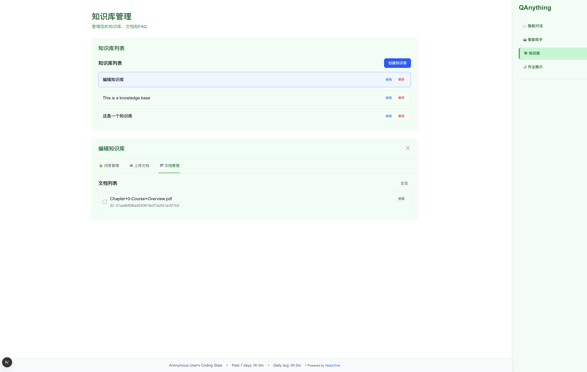
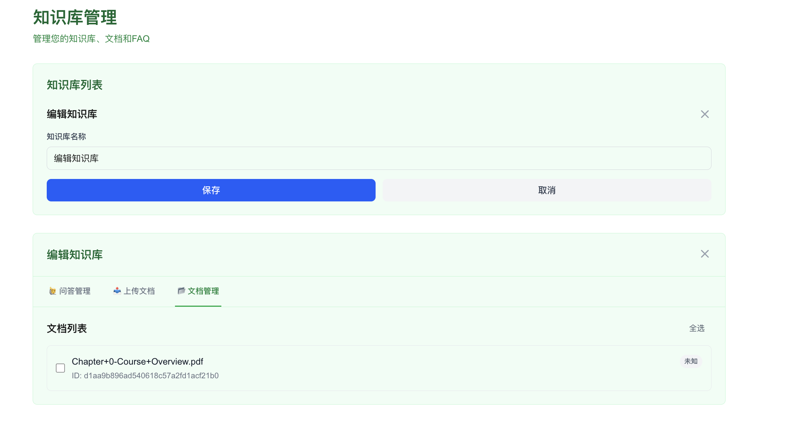
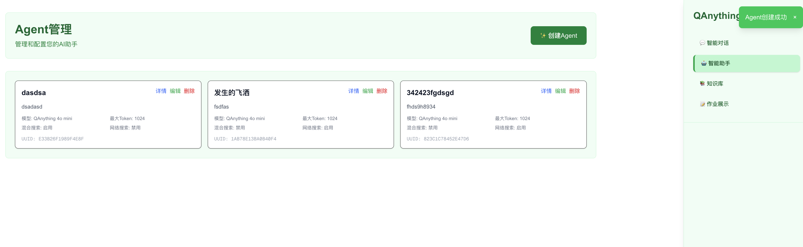
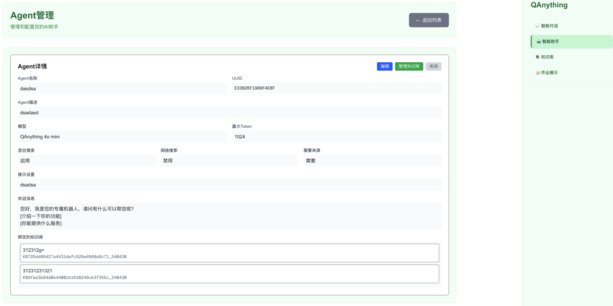
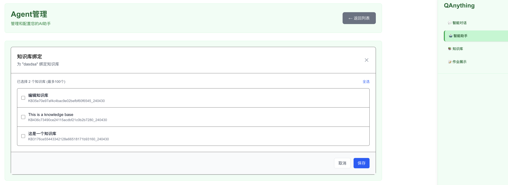
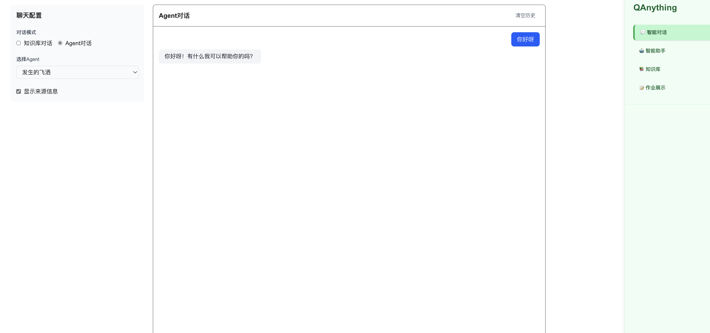
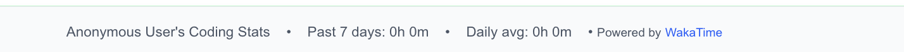
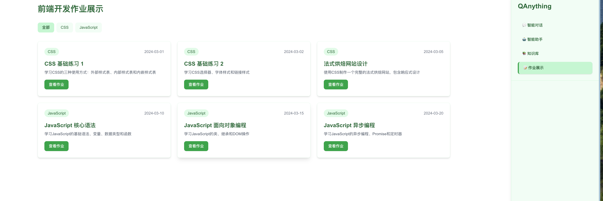
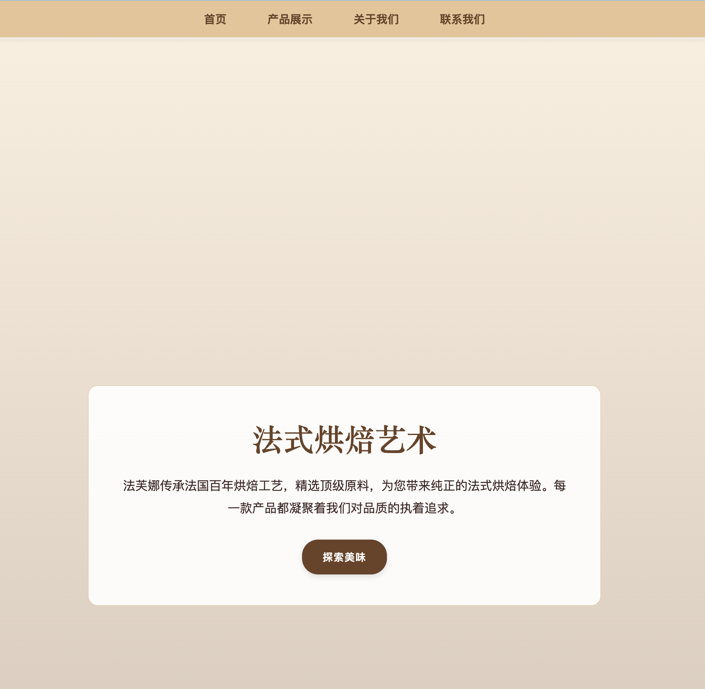

# QAnything Dashboard - Next.js 集成项目

## 项目简介

本项目是一个基于 Next.js 15 开发的综合性前端应用，集成了 QAnything LLM 服务和 WakaTime API，并整合了本学期全部课程练习。项目采用现代化的 React 架构，提供了完整的知识库管理、AI 智能助手、对话交互等功能，同时展示了前端开发学习的全过程。

## 核心技术栈

- **Next.js 15.3.4** - 使用 App Router 和 Turbopack
- **React 19** - 最新版本的 React 框架
- **TypeScript** - 类型安全的 JavaScript 超集
- **Tailwind CSS v4** - 原子化 CSS 框架
- **QAnything API** - 有道智云的大语言模型服务
- **WakaTime API** - 编程时间统计服务

## QAnything 集成路径与实现细节

### 选择路径：路径二（API 自行开发）

**选择原因：**
1. **技术深度**：通过直接调用 API 可以更深入理解 LLM 服务的工作原理
2. **用户体验**：自定义界面可以提供更好的用户交互体验
3. **功能完整性**：可以实现知识库管理、智能助手配置等完整功能
4. **学习价值**：更好地掌握 API 集成、错误处理、状态管理等核心技能

### 实现架构

#### 1. 服务层设计
- **KnowledgeBaseClient** (`src/lib/knowledge-base-client.ts`) - 知识库 API 封装
- **AgentService** (`src/services/agentService.ts`) - 智能助手服务
- **ChatService** (`src/services/chatService.ts`) - 对话服务

#### 2. API 响应处理
QAnything API 采用 `{result: [...]}` 格式返回数据，服务层自动提取 `result` 字段：
```typescript
// 统一的响应处理模式
const response = await fetch(url, options);
const data = await response.json();
return data.result || data;
```

#### 3. 核心功能实现

**知识库管理：**
- 创建、编辑、删除知识库
- 文件上传（支持多种格式）
- URL 资源导入
- FAQ 问答对管理





**智能助手配置：**
- Agent 创建与参数调优
- 知识库绑定
- 模型参数配置（maxToken、hybridSearch 等）







**智能对话界面：**
- 实时对话交互
- 流式输出支持
- 错误处理和加载状态



#### 4. 环境变量安全管理
```bash
# .env.local
QANYTHING_API_KEY=qanything-OE5gTDSs2pUp3qdhNbdCmWRo1qAI7TnX
NEXT_PUBLIC_QANYTHING_API_KEY=qanything-OE5gTDSs2pUp3qdhNbdCmWRo1qAI7TnX
NEXT_PUBLIC_WAKATIME_API_KEY=waka_6e2e3ca4-2cbc-4bc5-9ee2-96615dbd8988
```

## WakaTime API 集成方法

### 实现原理
通过 Next.js API Routes 创建后端代理，避免在前端暴露 API 密钥：

1. **API 路由设计**：
   - `/api/wakatime/user` - 获取用户信息
   - `/api/wakatime/stats/[range]` - 获取统计数据

2. **安全策略**：
   - API 密钥存储在服务端环境变量中
   - 前端通过内部 API 路由获取数据
   - 实现了错误处理和数据缓存

3. **展示实现**：
   - 页脚固定位置展示编程时长
   - 动态加载组件，避免 SSR 问题
   - 优雅的加载和错误状态



## Next.js 项目结构

```
src/
├── app/                    # App Router 页面
│   ├── agents/            # 智能助手管理页面
│   ├── api/               # API 路由
│   │   └── wakatime/      # WakaTime API 代理
│   ├── chat/              # 智能对话页面
│   ├── homework/          # 作业展示页面
│   └── layout.tsx         # 根布局
├── components/            # React 组件
│   ├── agent/             # 智能助手相关组件
│   ├── chat/              # 对话相关组件
│   ├── knowledge-base/    # 知识库相关组件
│   ├── ui/                # 通用 UI 组件
│   └── navigation.tsx     # 导航组件
├── hooks/                 # 自定义 Hooks
├── lib/                   # 工具库和客户端
├── services/              # 业务服务层
└── types/                 # TypeScript 类型定义
```

### 架构特点

1. **组件化设计**：每个功能模块都采用 Dashboard 模式，统一管理状态和子组件
2. **类型安全**：完整的 TypeScript 类型定义，确保开发时的类型安全
3. **响应式布局**：使用 Tailwind CSS 实现移动端适配
4. **状态管理**：使用 React Hooks 进行本地状态管理
5. **错误处理**：自定义 Toast 通知系统，替换原生 alert

## 旧作业整合方式

### 整合策略
采用混合式整合方案，既保持原有作业的独立性，又提供统一的访问入口：

1. **静态资源保存**：将 HTML 作业文件放置在 `public/` 目录下
2. **导航整合**：通过 `/homework` 页面提供统一的作业导航
3. **分类展示**：按技术类别（CSS、JavaScript）组织作业
4. **响应式卡片**：使用现代化的卡片布局展示作业信息

### 作业列表
- **CSS 基础练习**：外部样式表、选择器、字体样式
- **法式烘焙网站**：完整的响应式网站设计
- **JavaScript 核心语法**：变量、数据类型、函数
- **面向对象编程**：类、继承、DOM 操作
- **异步编程**：Promise、定时器、异步处理





## 项目运行指南

### 环境要求
- Node.js 18.0 或更高版本
- npm 或 yarn 包管理器

### 安装步骤

1. **克隆项目**
```bash
git clone https://github.com/huangn-xbmu/Wed-------.git
cd Wed--------/web期末作业
```

2. **安装依赖**
```bash
npm install
```

3. **环境配置**
创建 `.env.local` 文件：
```bash
# QAnything API 配置
NEXT_PUBLIC_QANYTHING_API_KEY=your_qanything_api_key
QANYTHING_API_KEY=your_qanything_api_key
# WakaTime API 配置  
NEXT_PUBLIC_WAKATIME_API_KEY=your_wakatime_api_key
```

4. **启动开发服务器**
```bash
npm run dev
```

5. **访问应用**
打开浏览器访问 `http://localhost:3000`

### 构建和部署

```bash
# 构建生产版本
npm run build

# 启动生产服务器
npm run start

# 代码质量检查
npm run lint
```

## 功能特性

### 🔧 技术特性
- **服务端渲染（SSR）**：Next.js App Router 提供的现代化渲染方案
- **类型安全**：完整的 TypeScript 支持
- **响应式设计**：适配各种设备屏幕
- **组件化开发**：模块化的 React 组件架构
- **API 安全**：后端代理模式保护敏感信息

### 🚀 业务功能
- **知识库管理**：完整的 CRUD 操作和文件管理
- **智能助手**：可配置的 AI Agent 管理
- **实时对话**：支持流式输出的对话界面
- **编程统计**：WakaTime 集成的编程时间追踪
- **作业展示**：课程练习的统一展示平台

## 开发规范

### 代码风格
- 使用 ESLint 进行代码质量检查
- 遵循 React 和 Next.js 最佳实践
- 采用函数式组件和 Hooks
- 使用 TypeScript 严格模式

### 提交规范
- 使用语义化的提交信息
- 定期进行代码重构和优化
- 保持良好的 Git 提交历史

## API 文档

### QAnything API 端点
- **知识库**：`https://openapi.youdao.com/q_anything/api/knowledge_bases`
- **智能助手**：`https://openapi.youdao.com/q_anything/api/agents`
- **对话**：`https://openapi.youdao.com/q_anything/api/chat`

### WakaTime API 端点
- **用户信息**：`https://wakatime.com/api/v1/users/current`
- **统计数据**：`https://wakatime.com/api/v1/users/current/stats/{range}`

## 部署说明

### Vercel 部署（推荐）
1. 连接 GitHub 仓库到 Vercel
2. 配置环境变量
3. 自动构建和部署

### 其他平台
支持任何支持 Next.js 的部署平台，如 Netlify、Railway 等。

## 许可证

本项目基于 MIT 许可证开源。

## 联系方式

如有问题或建议，请通过 GitHub Issues 或邮件联系。

